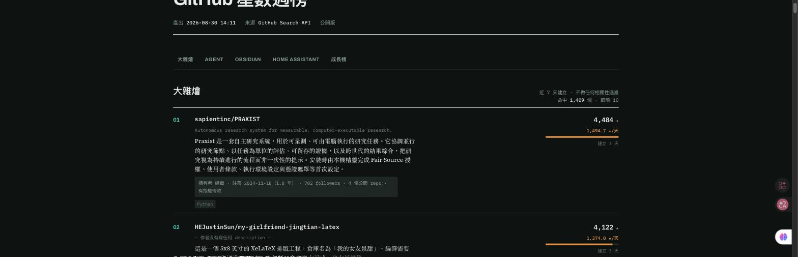

# gh-star-weekly

**A weekly GitHub trending report that tells you *facts*, not opinions — so you can spot the impersonators and topic-squatters yourself.**

📊 **[See this week's report →](https://lolorawu.github.io/gh-star-weekly/)**

[](https://github.com/LoloraWu/gh-star-weekly/actions/workflows/weekly.yml)
[](https://lolorawu.github.io/gh-star-weekly/)




---

## Why another trending list?

Every "GitHub trending" page shows you a name, a star count, and a one-line description written by the repo's own author. That is not enough to answer the only question that matters: **is this thing real?**

A repo with 968 stars in two days, called `metamask-desktop`, under an account named `MetaMask-AI`, looks completely legitimate in a normal trending list.

This report puts the same row like this:

> **MetaMask-AI/metamask-desktop** — 968 ★
> `Owner: personal account · registered 2026-07-17 (44 days) · 0 followers · 1 public repo · no license`

No accusation. No badge. Just the account's own record, printed the same way for **every** entry on the page. You draw your own conclusion — and you draw it in about one second.

## What every entry carries

All of it comes straight from the GitHub API. Nothing is inferred, nothing is scored:

| Signal | Why it matters |
|---|---|
| Owner type, account age, followers, public repos | A three-week-old account with 0 followers shipping a crypto wallet reads differently from a 2015 organization |
| License present | Brand-new "official" desktop apps with no license are worth a second look |
| Description present | A 4,000-star repo whose author never wrote one line about it is itself information |
| Keyword actually appears in name / description / README / topics | Catches topic-squatting: repos tagged `obsidian` that never mention Obsidian |
| Same owner's count on this board | One org taking 3 of 10 slots is a fact worth seeing |

## ★/day

Total stars ÷ days since creation.

The difference between **4,484 ★ over 3 days** and **4,484 ★ over 3 years** is the entire story, and a raw star count hides it completely. Every row shows ★/day with a bar — normalized **within each board**, because the scales differ by two orders of magnitude (this week: 1,494 ★/day at the top of the general board, 9.2 ★/day at the top of the Obsidian board).

## The growth board needs two runs

GitHub has **no API field for "stars gained this week."** The Trending page has no public API either.

So this keeps a weekly snapshot of `repo → stars` and diffs it. That means the growth board is empty on the very first run, and real from the second one on. Snapshots are committed to `data/snapshots/`, so star history accumulates into a dataset you can go back through.

## Make it yours

Everything is in `config.toml`. Four boards ship by default — a general one and three topic boards — but they are just queries:

```toml
[[category]]
key     = "rust"
label   = "Rust"
query   = "topic:rust"
days    = 30
keyword = "rust"     # checked against name / description / README / topics
```

Then:

```bash
python3 scripts/fetch.py          # boards + snapshot + factual signals
python3 scripts/render.py --public   # → docs/  (GitHub Pages)
```

Enable Pages on `main` → `/docs` and the Action publishes for you every week.

## No dependencies, no API key

`fetch.py` and `render.py` are **pure Python standard library**. No pip install, no virtualenv, nothing to keep alive.

Running inside GitHub Actions, the built-in `GITHUB_TOKEN` raises the API budget from 10 req/min and 60 req/hr to **30 req/min and 5,000 req/hr** — enough to pull READMEs and owner histories for every entry. You do not create or store any token yourself.

## Optional: prose summaries

`scripts/annotate.py` sends each README to an LLM and writes a short plain-language summary of what the project does.

**This is entirely optional.** Without it you still get every board, every number and every factual signal — you just lose the prose. The report is a static site either way.

The script shells out to the [Claude Code](https://claude.com/claude-code) CLI so it runs on an existing subscription rather than a metered API key. Point it at whatever you prefer; it only needs something that takes a prompt and returns JSON.

## How it runs

| Where | What |
|---|---|
| GitHub Actions, weekly | `fetch.py` — boards, snapshot, factual signals → committed |
| Anywhere with an LLM (optional) | `annotate.py` → `render.py` → published |

Fetching is split out on purpose: **the snapshot series must not skip a week**, or the growth board loses its baseline. Actions guarantees that even when your own machine is off. Summaries arriving late only delay the page.

## Limitations

- **Topics are self-assigned.** Authors tag their own repos, and tag-squatting is common — this week's `topic:obsidian` board had 2 of 10 entries that were actually Obsidian tooling. The keyword and same-owner signals surface this, but nothing filters it out automatically.
- **The star counts are GitHub's.** Purchased stars look identical to earned ones through the API. The account-history signals are the closest available proxy.
- **The published report is written in Traditional Chinese.** The layout, signals and numbers are language-neutral; the labels live in `scripts/render.py` and the summary language is one line in `scripts/annotate.py`.

## License

MIT

---

<details>
<summary><b>中文說明</b></summary>

### 這是什麼

每週把 GitHub 上「新竄起」與「星數成長最快」的專案整理成一頁，四個分類：大雜燴 / Agent / Obsidian / Home Assistant。

**網頁：<https://lolorawu.github.io/gh-star-weekly/>**

### 跟一般 trending 清單的差別

一般清單只給你名字、星數，和作者自己寫的一句話——那回答不了唯一重要的問題：**這東西是真的嗎？**

這份報告每一列都印同樣的事實欄位（帳號類型、註冊多久、followers、公開 repo 數、有無授權條款、關鍵字有沒有真的出現在 README、同一擁有者在本榜佔幾席）。**不下結論、不加標記**，讓讀者自己一秒看出問題。

### ★/天

總星數 ÷ 建立天數。「三天四千星」跟「三年四千星」是完全不同的兩件事，光看星數看不出來。強度條在**各分類內部**正規化——跨分類量級可以差兩個數量級。

### 週成長榜要跑兩次才有

GitHub **沒有「本週增加多少星」這個 API 欄位**，Trending 頁也沒有公開 API。所以只能自己每週存一份快照再 diff。第一次跑必然是空的，第二次起才有數字。快照進版控，星數歷史會自然累積成可回溯的資料集。

### 零依賴、不用自己準備 token

`fetch.py`、`render.py` 都是**純標準庫**。跑在 Actions 裡用內建的 `GITHUB_TOKEN`，額度從 10 req/min、60 req/hr 拉到 30 req/min、5000 req/hr。

### 敘述文字是選配

`annotate.py` 會讀 README 產出中文說明，但**拿掉它榜單與事實層照樣完整**，只是少了敘述。它呼叫 Claude Code CLI，走既有訂閱而不是按量計費的 API key。

### 改成自己的分類

全部在 `config.toml`，改 `query` 跟 `keyword` 就好。

</details>
